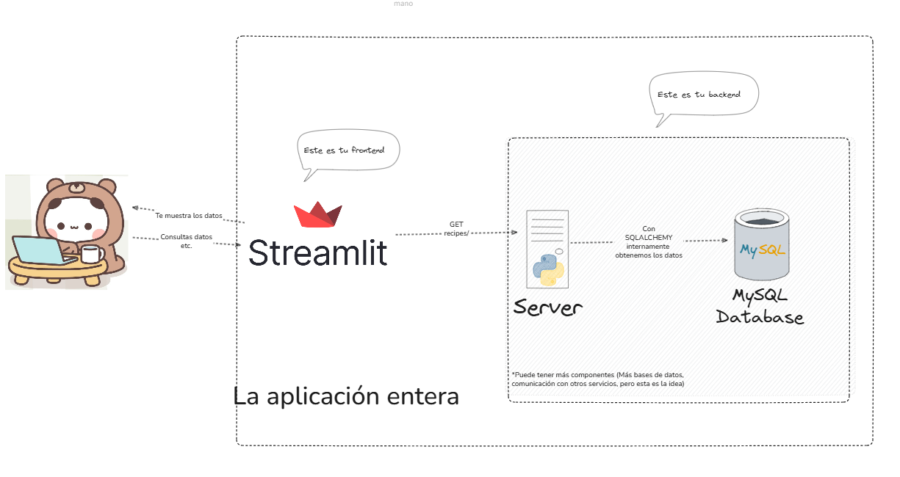

# app_backend
## Tabla de contenido
- [app\_backend](#app_backend)
  - [Tabla de contenido](#tabla-de-contenido)
  - [Descripción](#descripción)
  - [Endpoints](#endpoints)
  - [ORM](#orm)
  - [Modelos](#modelos)
  - [Schemas](#schemas)
  - [Instrucciones](#instrucciones)
  
## Descripción
Este es un ejemplo de un backend para una aplicación web. 
Básicamente tiene este flujo y arquitectura 
Entonces el flujo es el siguiente:
- Tu como usuario cuando consultas las recetas en el frontend (streamlit)
  - El frontend se comunica con el backend (FastAPI)
  - El backend consulta la base de datos (PostgreSQL)
  - El backend devuelve los datos al frontend
  - El frontend los muestra al usuario

## Endpoints
- `/recipes`
  - `GET`
    - Devuelve todas las recetas
  - `POST`
    - Crea una nueva receta
    - Requiere un JSON con los datos de la receta
    - Devuelve el ID de la receta creada
  - `GET`
    - `/recipes/{recipe_id}`
    - Devuelve los datos de una receta específica
    - Requiere el ID de la receta
    - Devuelve un JSON con los datos de la receta
  - `PUT`
    - Actualiza una receta existente
    - Requiere el ID de la receta y un JSON con los datos actualizados
    - Devuelve un mensaje de éxito
  - `DELETE`
    - Elimina una receta
    - Requiere el ID de la receta
    - Devuelve un mensaje de éxito

## ORM
Un ORM es una herramienta que permite mapear objetos de una base de datos relacional a objetos de una aplicación.
Digamos que tienes una tabla de recetas en tu base de datos, y cada fila en la tabla tiene columnas como `id`, `nombre`, `ingredientes`, `preparación`.
Entonces te permite interactuar con esta tabla como si fuera una lista de objetos `Recipe`, donde cada objeto tiene prácticamente los mismos atributos que las columnas de la tabla.
De esta manera puedes evitar escribir los queries SQL manualmente, y interactuar con la base de datos usando objetos y métodos más intuitivos.
Por ejemplo, en lugar de escribir un query SQL para insertar una nueva receta, simplemente creas un objeto `Recipe` y llamas al método `save()`.

## Modelos
Los modelos son las clases que representan las tablas de la base de datos.
En este caso, tendríamos un modelo `Recipe` que tiene los atributos `id`, `nombre`, `ingredientes`, `preparación`.

## Schemas
Los schemas son las clases que representan los datos que se envían y reciben a través de los endpoints.
En este caso, tendríamos un schema `Recipe` que tiene los atributos `id`, `nombre`, `ingredientes`, `preparación`.
La diferencia entre un modelo y un schema es que un modelo es la representación de la tabla en la base de datos, mientras que un schema es la representación de los datos que se envían y reciben a través de los endpoints.
Por ejemplo tu modelo puede tener los atributos `id`, `nombre`, `ingredientes`, `preparación`, y tu schema puede tener los mismos atributos, pero también puede tener más atributos como `created_at`, `updated_at`, etc.

## Instrucciones
- Crea un venv
- Actívalo
- Instala las dependencias
  - `pip install -r requirements.txt`
- Ejecuta la aplicación
  - `fastapi dev`
- Abre tu navegador y ve a `http://localhost:8000/docs` para ver la documentación de los endpoints. Acá también los puedes probar sin necesidad de usar herramientas como Postman. **Peor esto solo lo tiene fastapi o puedes usar OpenAPI que es una librería que documenta tus endpoints**
