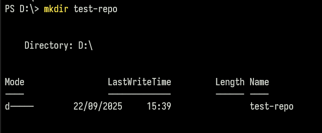
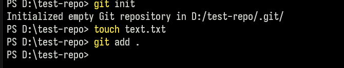
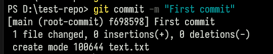
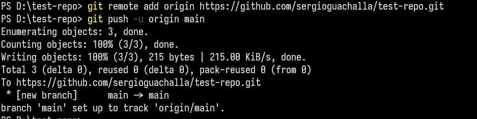
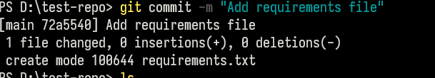
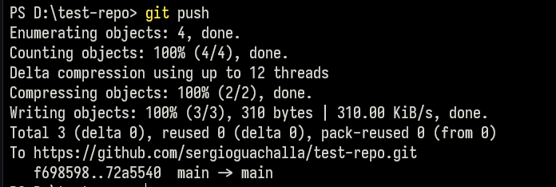

# Git y Github

## Tabla de contenidos

- [Git y Github](#git-y-github)
  - [Tabla de contenidos](#tabla-de-contenidos)
  - [Git](#git)
  - [Github](#github)
  - [Repositorio](#repositorio)
  - [Commit](#commit)
  - [Branch](#branch)
  - [Merge](#merge)
  - [Pull Request](#pull-request)
  - [Comandos y workflows](#comandos-y-workflows)
    - [Comandos básicos](#comandos-básicos)
    - [Comandos avanzados](#comandos-avanzados)
    - [Workflow](#workflow)
      - [Crear un repositorio](#crear-un-repositorio)
      - [Actualizar un repositorio](#actualizar-un-repositorio)
  
  
## Git
Git es un sistema de control de versiones. Básicamente es como una máquina de tiempo para el código. También permite regresar y crear nuevas versiones o "líneas de tiempo" como en Dr. Strange.
Entonces es como si estuvieras trabajando en una nueva receta y
cada vez que mejores esta receta o le haces cambios para ver que tal, anotas 
los cambios en un cuaderno donde puedes ver el historial de cambios que hiciste
**Git es el cuaderno**

## Github
Simplemente es un lugar donde puedes guardar tu código y compartirlo con otras personas, es el google drive del código.

## Repositorio
Es la carpeta donde está tu proyecto y ahi es donde git guarda el historial de cambios y demás cosas.
> Si te das cuenta, cuando clones este repositorio hay una carpeta que se llama
> .git y ahí está todo el historial de cambios de tu proyecto.

## Commit
Es prácticamente un snapshot del estado actual del proyecto.
Digamos que cada vez que ajustas la receta, por ejemplo, le agregas un ingrediente
o modificas la cantidad de algo y anotas qué es lo que estás haciendo, es como si estuvieras haciendo un commit.

## Branch
Esto es como una línea de tiempo separada del proyecto principal.
Digamos que tu receta tiene una salsa roja pero quieres ver por x o y, qué pasa si decides probar con una salsa verde. Entonces en vez de modificar la receta principal, decides crear una nueva donde puedes probar la salsa verde y ver si funciona.

## Merge
Una vez que decides que la salsa verde funciona, decides fusiona la salsa verde con la receta principal.

## Pull Request
Es como una solicitud de cambios. Digamos que has creado una nueva branch con la salsa verde y has hecho los cambios necesarios. Ahora quieres fusionar la branch con la branch principal. Para hacer eso, haces un pull request. El pull request es como una solicitud de cambios que le das a la persona que tiene el proyecto principal. Ella puede ver los cambios que has hecho y decidir si los acepta o no.

## Comandos y workflows

Un poquito más de teoria. Existen 3 etapas, unstaged, staged y committed.
- Unstaged: Son los cambios que has hecho en los archivos, pero no los has añadido al área de staging (modifcaste algo pero no hiciste `git add ...`)
- Staged: Son los cambios que has añadido al área de staging. (después de hacer `git add <archivo>` o `git add .`)
- Committed: Son los cambios que has hecho y que están guardados en el historial de cambios. (después de hacer `git commit -m "mensaje"`).

### Comandos básicos

- `git clone <url>`: Clona un repositorio remoto en tu máquina local.
- `git add <archivo>`: Añade un archivo al área de preparación (staging area). Si bien es buena práctica hacer el `git add <archivo>` para añadir todos los archivos, es posible añadir todos los cambios con `git add .`
- `git commit -m "mensaje"`: Crea un commit con los cambios en el área de preparación. El mensaje del commit es importante para recordar qué cambios hiciste. Normalmente se tiene una convención de mensajes de commit, por ejemplo: `git commit -m "Add feature X"` o `git commit -m "Fix bug Y"`. Ya depende de como estés trabajando, pero es una buena práctica seguir alguna convención.
- `git push`: Sube los cambios locales al repositorio remoto.
- `git pull`: Trae los cambios remotos y los fusiona con tu branch local.
- `git branch`: Muestra las branches locales.
- `git branch -a`: Muestra todas las branches (locales y remotas). Una branch remota es la que está en Github y la branch local es la que tienes en tu compu.
- `git branch <nombre>`: Crea una nueva branch.
- `git branch -d <nombre>`: Elimina una branch local.
- `git branch -r`: Muestra las branches remotas.
- `git branch -m <nombre>`: Renombra la branch actual.
- `git branch -m <nombre> <nuevo_nombre>`: Renombra una branch.
- `git commit --amend -m "nuevo mensaje"`: Modifica el último commit, si **es que no hiciste push** y te equivocaste en el mensaje.
- `git checkout <branch>`: Cambia a otra branch.
- `git checkout -b <nombre>`: Crea una nueva branch y cambia a ella.

### Comandos avanzados
- `git stash`: Guarda los cambios locales en una pila temporal. Esto es útil cuando necesitas cambiar de branch y no quieres perder los cambios que has hecho. 
- `git stash pop`: Recupera los cambios guardados en la pila temporal y los aplica a la branch actual.
- `git stash list`: Muestra una lista de todas las pilas temporales.
- `git stash drop`: Elimina la última pila temporal.
- `git stash clear`: Elimina todas las pilas temporales.

### Workflow
#### Crear un repositorio
- `mkdir <nombre_del_repositorio>`: Crea una nueva carpeta para el repositorio (1) 
- `cd <nombre_del_repositorio>`: Entras en la carpeta del repositorio (2) 
- `git init`: Inicializa un repositorio en la carpeta actual (3)
- `git add .`: Añade todos los archivos al área de preparación (4). 
- `git commit -m "Initial commit"`: Crea un commit con los cambios en el área de preparación (5). 
- `git remote add origin <url>`: Añade un repositorio remoto (6)
- `git push -u origin main`: Sube los cambios locales al repositorio remoto (7). 

#### Actualizar un repositorio
- `git pull`: Trae los cambios remotos y los fusiona con tu branch local (1) 
- `git add .`: Añade todos los archivos al área de preparación (2).
- `git commit -m "Update commit"`: Crea un commit con los cambios en el área de staging (3) 
- `git push`: Sube los cambios locales al repositorio remoto (4) 

Ahora para ver como consumir datos de un API muevete a la rama `api`.